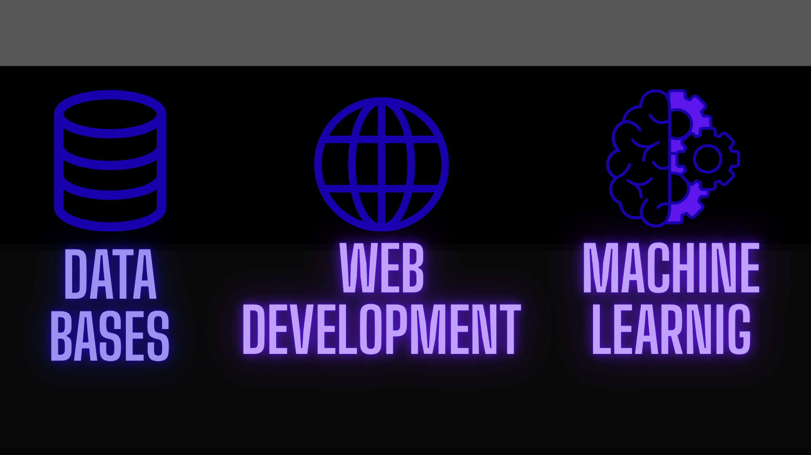
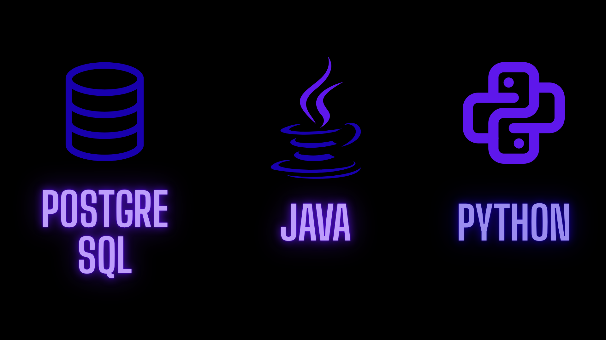

<!-- Encabezado centrado -->

# 🚀 Hola, soy **Julián Cabrera**
### *Backend Developer | Machine Learning Enthusiast | Systems Engineering Student*

Apasionado por el desarrollo backend, la optimización algorítmica y el aprendizaje automático.  
Siempre buscando mejorar, aprender y construir soluciones eficientes.

---

<!-- Imagen de áreas (lo que haces) -->

<!-- Imagen de lenguajes/herramientas -->

---

## 🔗 **Redes y Contacto**

<!-- ICONOS DE REDES -->

---

## 🧰 **Stack Tecnológico**

  

---

## 📈 **Mis estadísticas en GitHub**

<!-- STATS -->

<!-- STREAK -->

---

## 🧪 **Lenguajes más usados**

---

## 🎧 **Spotify – Lo que escucho últimamente**

  

---

## 🧠 **Sobre mí**

- Estudiante de Ingeniería de Sistemas  
- Backend y optimización de algoritmos  
- C++, Python, Java  
- Spring Boot, Django  
- PostgreSQL  
- Git & GitHub  
- Metodologías ágiles: Scrum, PSP, TSP y Crystal  
- Machine Learning e IA aplicada  
- Pasión por aprender y resolver problemas complejos  

---

## ✨ **Gracias por visitar mi perfil :)**

